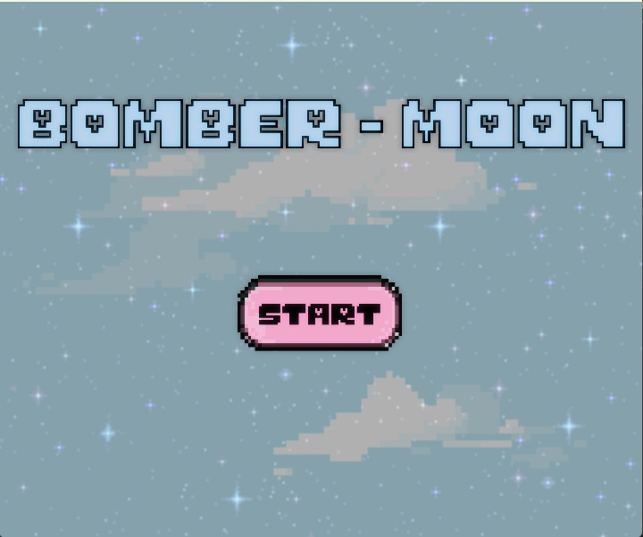
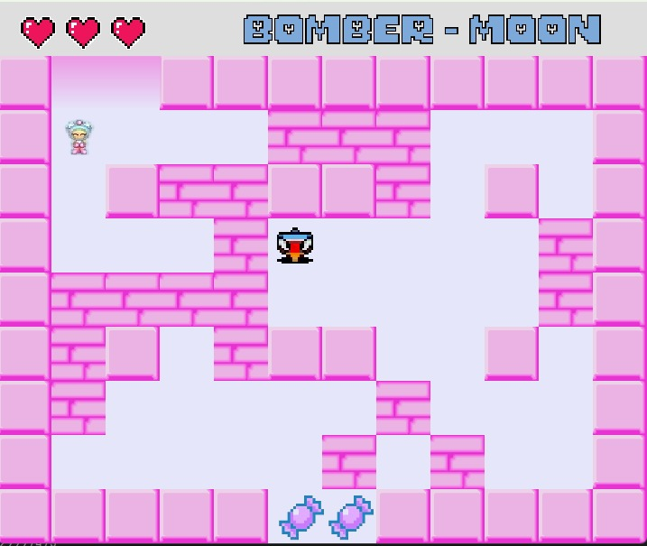
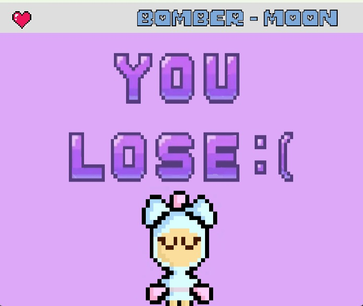
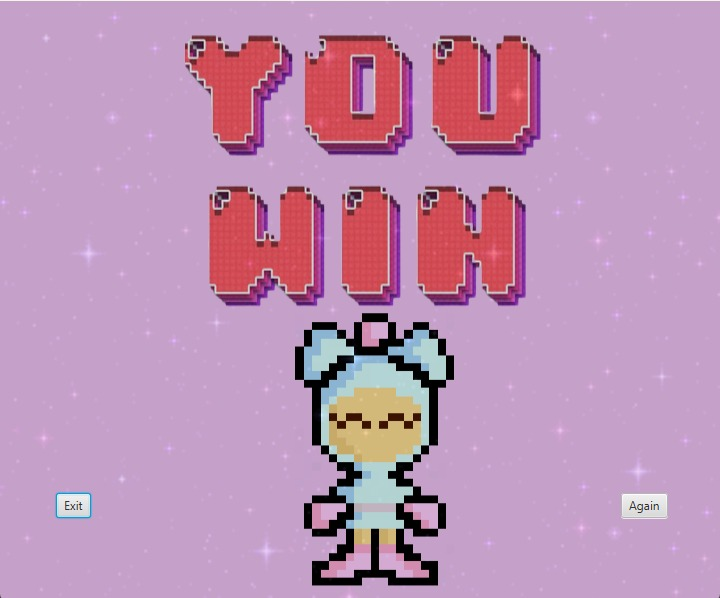

# TI3-APO2-Bomberman

*Bomberman* is a Konami owned game where your character *Bomberman* must place different bombs to destroy walls, escape from enemies and go through different worlds to win. For the integrative task of the course "Algoritmos y Programación II" from ICESI University, our own version of the game, **BOMBER-MOON**, is developed.

## Table of Contents

1. [Team Members and Professor](#team-members-and-professor)
2. [Technologies Used](#technologies-used)
3. [Game instructions](#game-instructions)
4. [Documentation](#documentation)
5. [View](#view)

##  Team Members and Professor

### Group

| Name | Student Code |
| ----------- | ----------- |
| [Mariana Agudelo Salazar](https://github.com/lilmagusa17)| A00398722 |
| [Natalia Vargas](https://github.com/NattVS) | A00398706 |
| [Vanessa Sánchez](https://github.com/VaSaMo) | A00397949 |

### Professor

Angela Patricia Villota Gomez, Ph.D.
- Professor at the Computing and Smart Systems Department at ICESI University.

## Technologies Used

- Java 19 (Logic): Used for the project's logic.
- JavaFX 19 (UI): Used for creating the user interface.
- Maven (Dependency management): Used for managing project dependencies.
- Visual Paradigm: Used for diagramming the project's structure using the UML standard.

## Game Instructions

*Bomber-Moon* is a game in which the player will have the ability to place bombs in the scene, in order to kill the enemies that want to end them and to make explode certain walls that block their way into the door. The player can carry out 5 different actions:

1. *Walk to the right:*
   By pressing the right arrow in the keyboard, the player is able to move to the right.
2. *Walk to the left:*
   By pressing the left arrow in the keyboard, the player is able to move to the left.
3. *Walk up:*
   By pressing the up arrow in the keyboard, the player is able to move up.
4. *Walk down:*
   By pressing the down arrow in the keyboard, the player is able to move down.
5. *Place bomb:*
   By pressing the space bar in the keyboard, the player is able to place a bomb in the place in which it is standing. The bomb will explode and destroy its surroundings after a few seconds.

Each of the three different scenes of the game in which the player is located at are surrounded and composed of two different types of walls:

1. *Wall:*
   Cannot be traspassed by the player and cannot be destroyed, so the player will have to move around them.
2. *Brick:*
   Cannot be traspassed by the player, so when they are located in the scene, the player will have to move around them. However, different to the walls, bricks can be destroyed by placing a bomb nearby.

Besides from the walls, the player will have other obstacle, the enemies, evil spinning tops that try to chase the character with the intention of ending their life. Each scene has a different number of enemies that increase the difficulty of the game. As bricks, enemies can be killed by placing a bomb nearby. 

However, the player must be very careful when placing a bomb. The character has, in every scene, only three lives, that are lost each time *bomber-moon* is killed by an enemy or by a bomb. If all three lives are lost before getting through the door of the last scene, the player dies and the game is over.
But don't lose hope, because when the character is able to go through a door located in each of the scenes, it will not only change of "level", but their lives will be recharged, gaining all the lives that were lost. In order to finally win the game, the player must go through the door of the third screen.

**Bomber-Moon** is an amazing and interactive game that clearly shows the developers' understandment and knowledge of the concepts taught along the course's development.

## Documentation

Inside the project structure, you will find a folder called `doc` that contains the project´s documentation, including:
- Project's statement.
- Class diagram of the structure of the program.
- Javadoc documentation of the code.

## View

*Start screen*

*Game screen*

*Win screen*

*Win screen*

